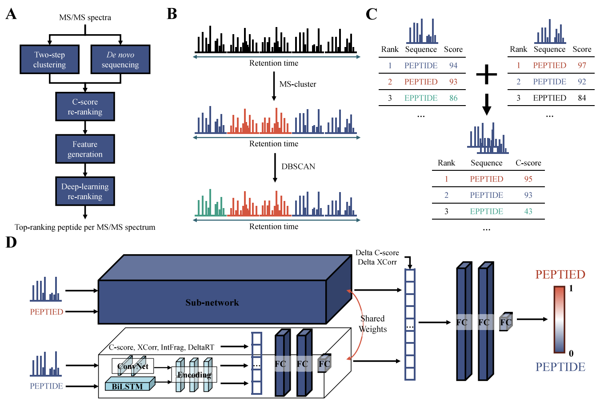

# NovoRank: Machine Learning-Based Post-Processing Tool for De Novo Peptide Sequencing

NovoRank is a post-processing tool designed to improve the accuracy of de novo peptide sequencing in proteomics. Unlike database-dependent methods, de novo sequencing derives peptide sequences directly from tandem mass spectrometry (MS/MS) data, enabling the discovery of novel peptides. However, reliance on incomplete scoring functions often leads to incorrect identifications. NovoRank addresses this by re-ranking candidate peptides to recover correct identifications, enhancing both precision and recall. By reassigning the optimal peptide from diverse de novo sequencing results, NovoRank offers a robust solution for overcoming the noise and ambiguities inherent in MS/MS data.

For detailed insights behind NovoRank, refer to the [**NovoRank paper**]().

<br>

<p align="center">
    
</p>
<hr>

## Overview
#### Code structure
``` Unicode
NovoRank
  │ 
  ├── generate_candidates_and_extract_features.py
  │ 
  ├── src
  │    │     
  │    ├── features
  │    │     └── FeatureProcessor.py: Functions for feature calculation
  │    │       
  │    ├── loader
  │    │     └── dataloader.py: Functions for data loading
  │    │  
  │    └─── utils
  │          ├── config.py: Command-line argument parsing and configuration file loading
  │          ├── process.py: Functions for performing data processing
  │          └── utils.py: Utility functions providing support
  │
  ├─── pretrained: Pretrained NovoRank models (Casanovo, PEAKS, pNovo3) in .h5 format
  │
  └─── software
        ├── CometX: XCorr calculation software (in-house software)
        └── MSCluster: Spectral clustering software
```

## Datasets
All datasets used in this work are available for download from [**Zenodo**](https://zenodo.org/records/14046459).

## Configuration
  
  The [**config.yaml**](https://github.com/jangho721/NovoRank/blob/main/config.yaml) is used to set up the parameters and initial configurations required to run NovoRank. It contains default values, and descriptions for each option are provided as comments within it.

## Requirements

NovoRank is implemented and tested with the following dependencies:
### Software and Libraries:
- Python == 3.9
- [**DeepLC**](https://github.com/compomics/DeepLC)
- [**MS-Cluster**](http://proteomics.ucsd.edu/software-tools/ms-clusterarchives)
- [**CometX**](https://github.com/jangho721/NovoRank/tree/main/software/CometX) (In-house software modified to calculate XCorr, based on Comet software)
<br>

### To install the required Python packages:
1. Clone the repository or download the code.
2. Install the dependencies listed in `requirements.txt`:
```c
pip install -r requirements.txt
```

## Usage
<pre>
⦁ Command: java -jar CyGate.jar --c configFile
- Example: java -jar CyGate.jar --c foo.txt
</pre>

## Results
<pre>
- For the files specified in Data.Sample, *_cygated.csv files are generated.
- The gating results are added to the last column, named 'Gated'.
</pre>

## Credits
NovoRank is created by <a href="https://jangho721.github.io/" target="_blank">Jangho Seo</a>, Seunghyuk Choi, and Eunok Paek at the Hanyang University.

## Citation
```bibTeX
@article{sep2024novorank,
  title = {NovoRank: Refinement for De Novo Peptide Sequencing Based on Spectral Clustering and Deep Learning},
  shorttitle = {NovoRank},
  author = {Seo, Jangho and Choi, Seunghyuk and Paek, Eunok},
  journal={Journal of Proteome Research},
  year={2024}
}
```

## License
<pre>
- NovoRank © 2024 is licensed under Creative Commons Attribution-NonCommercial-ShareAlike 4.0 International.
  This license requires that reusers give credit to the creator. It allows reusers to distribute, 
  remix, adapt, and build upon the material in any medium or format, for noncommercial purposes only. 
  If others modify or adapt the material, they must license the modified material under identical terms.
</pre>

## Contact
If you have any questions, feel free to [open an issue](https://github.com/jangho721/NovoRank/issues/new) or contact [Jangho Seo](https://jangho721.github.io/) or any of the contributors listed above.
